# DataForge Studio - Architecture & Engineering Specification

## Executive Overview
DataForge Studio has been completely productionalized from its prototype (previously spanning a Python Flask backend and a ReactJS frontend) into a 100% native Windows C++ desktop application. The application delivers zero-runtime-dependency execution, instantaneous cold boot, robust offline SQLite database inspection, high-performance asynchronous HTTP networking via WinHTTP, and pixel-perfect reproduction of the modern slate/dark UI visual aesthetic.

---

## Architecture Topology

```mermaid
graph TD
    subgraph UI_Layer ["UI Layer (Win32 & Common Controls v6)"]
        MainWindow["MainWindow (Frame, DPI, Layout, File Drops)"]
        HeaderBar["HeaderBar (Navigation, Presets, Modals, Theme)"]
        ApiClientView["ApiClientView (Collections Tree, History, Request Builder, Response Viewer)"]
        DbStudioView["DbStudioView (Databases, Tables, SQL Console, Data Grid, ER Diagram)"]
        Modals["Modals (Environments, Globals, cURL, OpenAPI, CodeGen, New DB, Docs)"]
    end

    subgraph Services_Layer ["Services Layer (Business Logic & State)"]
        StoreManager["StoreManager (JSON Collections, Environments, History, Secret Masking)"]
        JobManager["JobManager (Thread Pool, CancellationTokens, Background Tasks)"]
        ArchiveService["ArchiveService (Native ZIP Compression, CRC32 Checksums)"]
    end

    subgraph Core_Layer ["Core Layer (Domain Engines - Zero UI)"]
        HttpEngine["HttpEngine (Native WinHTTP, Headers, Query, Auth, Form-Data, TLS)"]
        DbEngine["DbEngine (Windows winsqlite3, DDL Introspection, Pagination, CRUD, Export)"]
        CurlParser["CurlParser (cURL CLI String -> ApiRequest)"]
        OpenApiParser["OpenApiParser (OpenAPI 3.0 / Swagger 2.0 -> Collection)"]
        CodeGen["CodeGen (cURL, Python Requests, JS Fetch, Axios)"]
        Assertions["Assertions (Postman Test Execution Engine)"]
        VariableResolver["VariableResolver ({{var}} & :param Scoped Interpolation)"]
    end

    subgraph Platform_Layer ["Platform Layer (OS Abstractions)"]
        TempWorkspace["TempWorkspace (Scoped RAII Temp Directories, Traversal Defense)"]
        ProcessRunner["ProcessRunner (Direct CreateProcessW, Piped I/O, Job Containment)"]
        CredentialStore["CredentialStore (DPAPI / Local AppData Persistence)"]
    end

    UI_Layer --> Services_Layer
    Services_Layer --> Core_Layer
    Services_Layer --> Platform_Layer
    Core_Layer --> Platform_Layer
```



---

## Layered Design Principles

### 1. UI Layer (`cpp/app/`)
- **Technology Profile:** Win32 API with Common Controls v6 (`comctl32.dll`), GDI double-buffered custom drawing, Per-Monitor V2 High-DPI scaling.
- **Theme Preservation:** Full fidelity to DataForge Studio's sleek slate dark palette:
  - Base Background: `#0f172a` (Slate 900)
  - Card & Sidebar Background: `#1e293b` (Slate 800)
  - Borders & Dividers: `#334155` (Slate 700)
  - Primary Accent: `#3b82f6` (Blue 500)
  - Method Pill Badges: GET (Green `#10b981`), POST (Blue `#3b82f6`), PUT (Amber `#f59e0b`), DELETE (Red `#ef4444`), PATCH (Purple `#8b5cf6`).
- **Thread Safety:** All UI windows and controls are owned strictly by the main UI thread. Long-running network or database calls run on worker threads and communicate back using `WM_APP` message dispatches.

### 2. Services Layer (`cpp/services/`)
- **`StoreManager`:** Thread-safe persistent storage using JSON serialization under `%LOCALAPPDATA%\DataForgeStudio\data\`. Handles collections, folders, environments, globals, and execution history.
- **`JobManager`:** Asynchronous execution coordinator with cooperative `CancellationToken` checks and worker thread pools.
- **`ArchiveService`:** 100% native ZIP archive writer utilizing standard Deflate compression and CRC-32 integrity calculation, producing portable ZIP artifacts with zero external tool dependencies.

### 3. Core Layer (`cpp/core/`)
- **`HttpEngine`:** Native Windows HTTP client built on `winhttp.dll`. Supports all HTTP methods, synchronous and asynchronous modes, customizable timeouts, TLS verification, proxy configuration, multipart/form-data encoding, and sub-millisecond latency tracking.
- **`DbEngine`:** SQLite database engine interfacing directly with the Windows 10/11 built-in `winsqlite3.dll` (`<winsqlite/winsqlite3.h>`). Manages multiple open databases, seeds tutorial databases (`ecommerce.db` and `dev_studio.db`), introspects full schema DDL, executes multi-statement scripts, performs paginated table reads with sorting and searching, supports atomic row CRUD operations, and generates ER diagram relationship graphs.
- **`CurlParser` & `OpenApiParser`:** High-speed native parsers that ingest command-line cURL strings or OpenAPI/Swagger JSON files into native `ApiRequest` and `Collection` structures.
- **`Assertions`:** Postman assertion evaluation engine (`pm.test`, status code checks, response time limits, header existence, JSON path evaluation).
- **`CodeGen`:** Native code generator producing client code in cURL, Python (`requests`), JavaScript (`fetch`), and JavaScript (`axios`).

### 4. Platform Layer (`cpp/platform/`)
- **`TempWorkspace`:** RAII-managed temporary working directories created under the system temp path (`GetTempPath2W` with `GetTempPathW` fallback). Enforces lexical path containment, defends against directory traversal (`..`), and automatically cleans up managed scratch directories upon destruction.
- **`ProcessRunner`:** Secure execution runner invoking `CreateProcessW` directly without routing through `cmd.exe /c` or `system()`, eliminating shell injection risks. Redirects standard pipes asynchronously without deadlocks.

---

## Storage & Persistence Topology

```text
%LOCALAPPDATA%\DataForgeStudio\
├── data/
│   ├── collections.json         # Request collections & folder hierarchies
│   ├── environments.json        # User environments & variables
│   ├── globals.json             # Global variable store
│   └── history.json             # API request history snapshots
├── databases/
│   ├── ecommerce.db             # Seeded E-Commerce database (sample)
│   ├── dev_studio.db            # Seeded Dev Studio database (sample)
│   └── *.db                     # User-created SQLite databases
├── logs/                        # Bounded, redacted application diagnostics
└── temp/                        # Scoped processing workspaces
```

---

## Build System & Toolchain Configuration
- **Solution File:** `cpp/DataForgeStudio.sln`
- **Configuration Defaults:** Language Standard `C++17` (`/std:c++17`), Toolset `v145` (Visual Studio 2022/2026), Architecture `x64`, Unicode (`/D _UNICODE /D UNICODE`), Conformance (`/permissive- /utf-8`), Warnings (`/W4`).
- **Dependencies:** Built-in Windows SDK system libraries (`winhttp.lib`, `winsqlite3.lib`, `comctl32.lib`, `shlwapi.lib`, `shell32.lib`, `ole32.lib`, `comdlg32.lib`, `gdi32.lib`). Vendored header-only `nlohmann/json.hpp`. Zero Python or Node.js runtime components.
